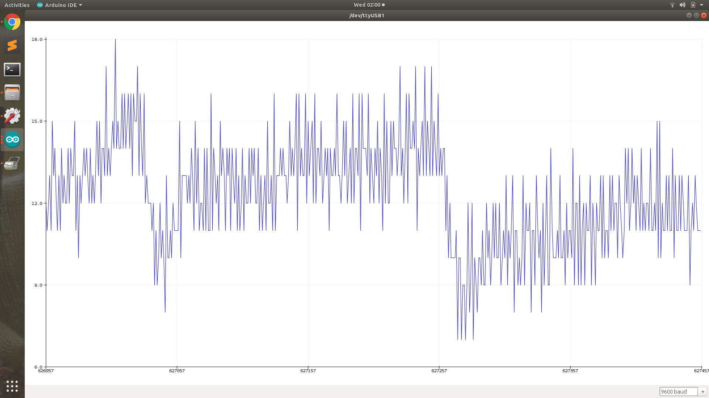
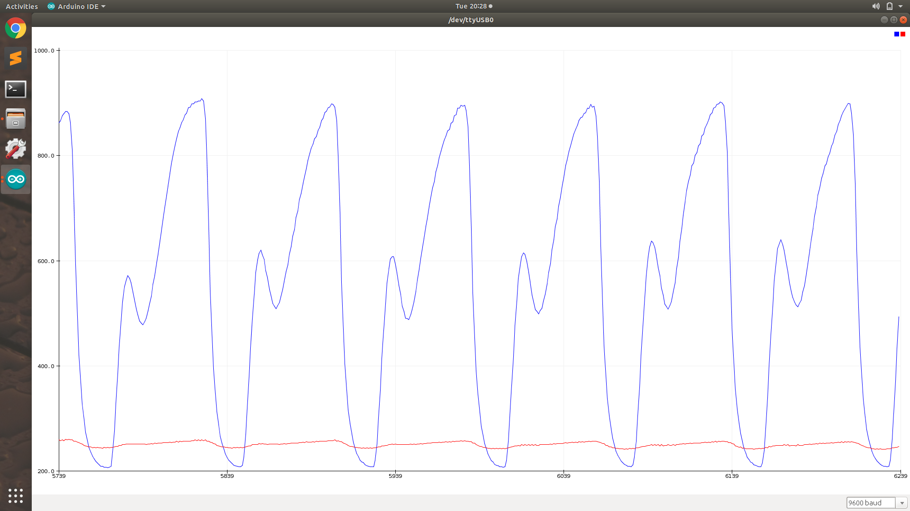

# Non invasive glucometer
* We measure glucose level without piercing.
* Using a IR receiver and transmitter.
* We remove DC offset from wave.
* And we get this tpye pulse after using op-amp amplifier with amplification 200-300,

* Then we use 2Hz low pass filter.
And use regression on Vpp and Vdc.
* Then  get a formula between voltage and glucose level.

